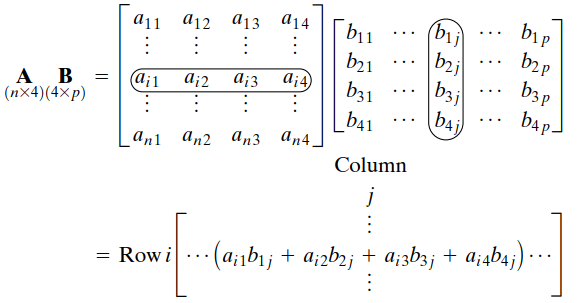

# Matrices
A **matrix** is a rectangular array or table of numbers, tables, symbols, or expressions, arranged in rows and columns, which is used to represent a mathematical object or a property of such an object.

$$\begin{bmatrix}
a_{11} & a_{12} & \cdots & a_{1n} \\
a_{21} & a_{22} & \cdots & a_{2n} \\
\vdots & \vdots & \ddots & \vdots \\
a_{m1} & a_{m2} & \cdots & a_{mn} \\
\end{bmatrix}$$

A matrix with $m$ rows and $n$ columns is reffered to as a " $m$ by $n$ matrix", a " $m\times n$-matrix", or a matrix of dimension $m\times n$.[^matrix-wiki]

[^matrix-wiki]: [Matrix (mathematics) - Wikipedia](https://en.wikipedia.org/wiki/Matrix_(mathematics))

## Matrix multiplication
[^applied-multi-stat]

If $\mathbf{A}$ is an $m\times n$ matrix and $\mathbf{B}$ is an $n\times p$ matrix,

$$\mathbf{A}=\begin{bmatrix}
 a_{11} & a_{12} & \cdots & a_{1n} \\
 a_{21} & a_{22} & \cdots & a_{2n} \\
\vdots & \vdots & \ddots & \vdots \\
 a_{m1} & a_{m2} & \cdots & a_{mn} \\
\end{bmatrix},\quad
\mathbf{B}=\begin{bmatrix}
 b_{11} & b_{12} & \cdots & b_{1p} \\
 b_{21} & b_{22} & \cdots & b_{2p} \\
\vdots & \vdots & \ddots & \vdots \\
 b_{n1} & b_{n2} & \cdots & b_{np} \\
\end{bmatrix}$$

the *matrix product* $\mathbf{C}=\mathbf{A}\mathbf{B}$ is defined to be the $m\times p$ matrix

$$\mathbf{C}=\begin{bmatrix}
 c_{11} & c_{12} & \cdots & c_{1p} \\
 c_{21} & c_{22} & \cdots & c_{2p} \\
\vdots & \vdots & \ddots & \vdots \\
 c_{m1} & c_{m2} & \cdots & c_{mp} \\
\end{bmatrix}$$

such that
$$c_{ij} = a_{i1}b_{1j} + a_{i2}b_{2j} +\cdots + a_{in}b_{nj}= \sum_{k=1}^n a_{ik}b_{kj},$$
for $i=1,\cdots,m$ and $j=1,\cdots,p$.

That is, the entry $c_{ij}$ of the product is obtained by multiplying term-by-term the entries of the $i$ th row of $\mathbf{A}$ and the $j$ th column of $\mathbf{B}$, and summing these $n$ products. In other words, $c_{ij}$ is the dot product of the $i$ th row of $\mathbf{A}$ and the $j$ th column of $\mathbf{B}$.[^mul-wiki]

[^mul-wiki]: [Matrix multiplication - Wikipedia](https://en.wikipedia.org/wiki/Matrix_multiplication)
[^applied-multi-stat]: *Applied Multivariate Statistical Analysis*

## Identity matrices
Let $\mathbf{I}$ denote the square matrix with ones on the diagonal and zeros elsewhere. So
$$\mathbf{I}\mathbf{A}=\mathbf{A}\mathbf{I}=\mathbf{A}$$
for any square matrix $\mathbf{A}$.

## Matrix inversion
If there exists a matrix $\mathbf{B}$ such that
$$\mathbf{B}\mathbf{A}=\mathbf{A}\mathbf{B}=\mathbf{I}$$
then $\mathbf{B}$ is called the **inverse** of $\mathbf{A}$ and is denoted by $\mathbf{A}^{-1}$.

The condition that an inverse exists is that the $k$ columns $\mathbf{a_1},\mathbf{a_2},\cdots,\mathbf{a_k}$ of $\mathbf{A}$ are linearly independent, i.e.,
$$c_1\mathbf{a_1}+c_2\mathbf{a_2}+\cdots+c_k\mathbf{a_k}=0 \text{ only if }c_1=\cdots=c_k=0$$

## Orthogonal matrices
$$\mathbf{Q}\mathbf{Q}'=\mathbf{Q'}\mathbf{Q}=\mathbf{I}
\quad\text{or}\quad
\mathbf{Q}'=\mathbf{Q}^{-1}$$