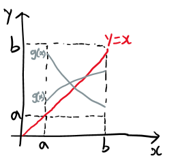
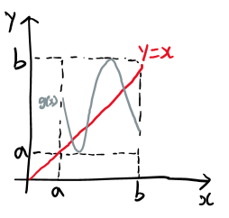

# Fixed Points
A **fixed point** of a function is an element that is mapped to itself by the function.

## Finding fixed points
 

Assume that $g\in C[a,b]$.
- If the range of the mapping $y=g(x)$ satisfies $y\in [a,b]$ for all $x\in [a,b]$, then $g$ has a fixed point in $[a,b]$.

  横穿 $(a,a)(b,b)$ 矩形的曲线必与竖穿矩形的曲线（ $y=x$ ）相交。
- Furthermore, suppose that $g'(x)$ is defined over $(a,b)$ and that a positive constant $K<1$ exists with $|g'(x)|\le K < 1$ for all $x\in (a,b)$; then $g$ has a *unique* fixed point $P$ in $[a,b]$.[^numerical]
  
  若曲线斜率的绝对值恒小于 $1$，则曲线最多与 $y=x$ 相交一次。（曲线斜率存在大于等于 $1$ 时可能相交一次，可能相交多次，也可能不相交，需要进一步判断。）

[^numerical]: *Numerical Methods Using MATLAB*