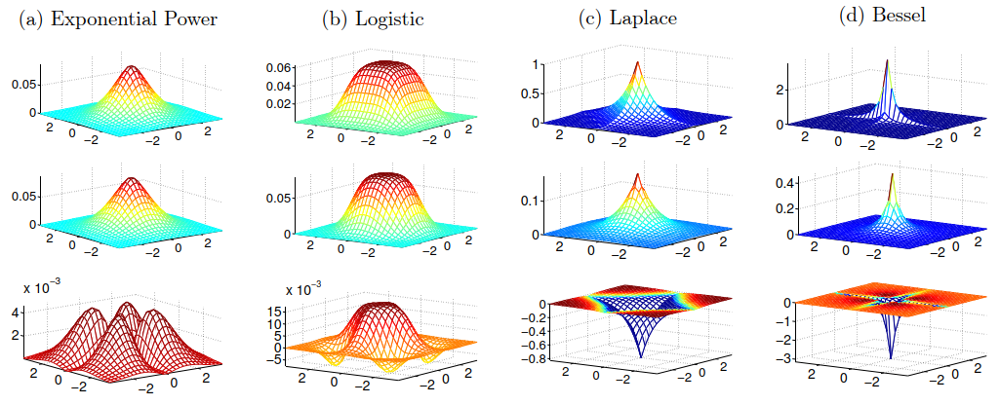

# [Logistic Function](https://en.wikipedia.org/wiki/Logistic_function)
Definition:
$$f(x)={L \over 1+e^{-k}(x-x_0)}$$
where
- $x_0$, the $x$ value of the function's midpoint;
- $L$, the supremum of the values of the function;
- $k$, the logistic growth rate or steepness of the curve.

The standard logistic function, where $L=1,k=1,x_0=0$, is sometimes called **the sigmoid**:
$$\sigma(x)={1\over 1+e^{-x}}$$

## Multivariate logistic function
 [^Boisbunon]

[^Boisbunon]: Boisbunon, Aurélie. “The Class of Multivariate Spherically Symmetric Distributions,” no. 0 (2012).