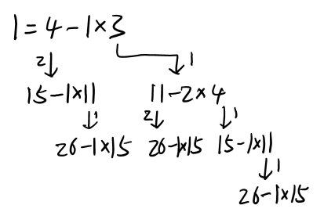

# Greatest Common Divisor
The **greatest common divisor (GCD)** of two or more intergers, which are not all zero, is the largest positive interger that divides each of the intergers.[^wiki]

## Calculation
### Using prime factorizations
In practice, this method is only feasible for small numbers.

Example:

If

$$\begin{align}
a&=84=2\times 2\times 2\times 3\times 7 \\
b&=30=2\times 3\times 5
\end{align}$$

then
$$\gcd(a, b)=2\times 3=6$$

### Euclid's algorithm
**Euclid's algorithm (更相减损术)**

$$\gcd(a, b)=\gcd(a-b, b)\quad (a > b)$$

Example:

$$\begin{align}
\gcd(84, 30)
&=\gcd(54, 30)
=\gcd(24, 30) \\
&=\gcd(24, 6) \\
&=\gcd(18, 6)
=\cdots
=\gcd(0, 6) \\
&=6
\end{align}$$


### Euclidean algorithm
**Euclidean algorithm (辗转相除法, 欧几里得算法)**

$$\begin{align}
\gcd(a, b)
&=\gcd(a-mb, b)\quad (m\in Z, a-mb > 0) \\
&=\gcd(a \mod b, b)
\end{align}$$

Example:

$$\gcd(84, 30)
=\gcd(24, 30)
=\gcd(24, 6)
=\gcd(0, 6)
=6$$

Python implementation:
```python
def gcd_aux(a, b):
    if b == 0:
        return a
    return gcd_aux(b, a % b)

def gcd(a, b):
    if a < b:
        a, b = b, a
    return gcd_aux(a, b)
```

## Bézout's identity
**Bézout's identity (裴蜀等式)**:

$$\exists p,q\in Z,\quad\gcd(a,b)=p\cdot a + q\cdot b \quad$$

## Extended Euclidean algorithm
The **extended Euclidean algorithm** is an extension to the Eculidean algorithm. It computes the greatest common divisor and the coefficients of Bézout's identity of two integers.

For example, if we want to solve $p$ and $q$ in
$$26p+15q=1$$
where $p,q\in Z$.

We may first do some Euclidean division:

$$\begin{align}
\overline{26}&=1\times \overline{\underline{15}}+\underline{11} \\
\overline{15}&=1\times \overline{\underline{11}}+\underline{4} \\
\overline{11}&=2\times \overline{\underline{4}}+\underline{3} \\
\overline{4}&=1\times \overline{\underline{3}}+\underline{1} \\
\overline{1}&=1\times \overline{1}
\end{align}$$

then



$$\begin{align}
1&=4-1\times 3 \\
&=[15-1\times (26-1\times 15)]-1\times[26-1\times 15 - 2\times (15 - 1\times (26-1\times 15))] \\
&= -4\times 26 + 7\times 15
\end{align}$$


[^wiki]: [Greatest common divisor - Wikipedia](https://en.wikipedia.org/wiki/Greatest_common_divisor#Calculation)